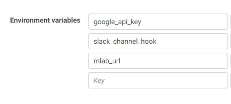
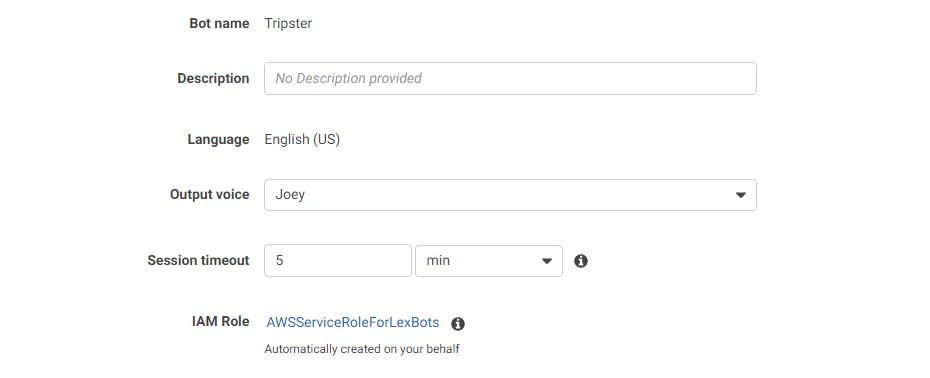
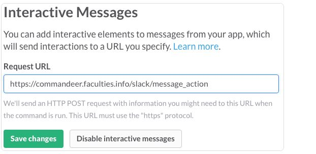

# aws-lex-lambda-slack-bot-example

Tripster SlackBot 
==================

Tripster is a chat bot that helps a group decide hangout destinations.
It can help you plan exiciting new trips or help you decide your dinner destinations.

Steps to build the Tripster Bot 
---------------------------------

Step 1: Create the AWS Lambda function 
--------------------------------------

Instructions: 
-------------

Zip the folders models,node_modules, the index.js file and the package.json that you downloaded.
Note: compress the files together not the folder.
Now, go to AWS Lambda console. Create a new lambda function.
Select "Blank Fuction" as a blueprint. in "Configure triggers" section
press next. Now configure your lambda function.

##### Configure Function: 

      1. Name your lambda function : tripster
      2. Add Description - A trip planning function that uses Google Places API
      3. Runtime - Node.js 6.10
      4. Code Entry - Upload the zip you downloaded
      5. Handler Section - index.findPlaces
      6. Select an existing role -  lambda_basic_execution
      4. Set time to 5 minutes
      5. Configure environment variables for our lambda function (We will have the Google API key, slack interactive message url and the mongolab credentials)

Step 2: Creating your Bot 
-------------------------

#### 1. Create Amazon Lex Bot 

Go to Amazon Lex console on create your Amazon lex bot page. Select
custom app and provide the following information, then choose Create.

###### Remember to use a unique name for your bot 

##### Provide The Following Information: 

      1. Bot Name: Tripster
      2. Choose an output voice - Joey
      3. Set Session Timeout - 5 mins
      4. Add AMazon lex basic role to your Bot app - AWSServiceRoleForLexBots

Step 2: Creating your Bot Conversations 
---------------------------------------
The lex_bot_def file will defines all the details about the Lex bot including the intents and the slots.
Using that you can define the Lex bot.

Step 3: Configure Bot for Slack 
---------------------------------------

All the steps needed for configuring the slack bot with lex can be found on the link:
http://docs.aws.amazon.com/lex/latest/dg/slack-bot-association.html

Apart from these steps, interactive messaging for slack bot will also need to be enabled.
We will pass this config in our AWS Lambda function.

Step 3: Configure MongoDB instance 
---------------------------------------
We will also need MongoDB instance for saving voting information.
After creating the instance, we will use the instance connection URI in the Lambda configuration.

Step 4: Configure Google API 
---------------------------------------
We are using Google places API in our application to fetch results from google.
To create API keys, use url: https://console.developers.google.com/dcredirect
We will use this key in our Lambda function configuration.

Using the Slack BOT 
---------------------------------------
The commands are also clearly stated in the lex bot definition but to give you an overview,
I have mentioned some commands.

##### To use the bot you can use commans like:
      1) @tripster lets plan a trip
      2) @tripster we are bored

The bot then asks you what you want to do.

#### You can select things like:
      1) Paintball
      2) Kayaking
      3) Italian Food
      4) Pizza
      5) Any similar things

#### You will also have to choose an area so that the bot can find results that are near to you.
You dont need zipcode but try to be precise. You can say:
      1) San Jose California (If multiple places with same name exist, provide more details that identify the place you want to select)
      2) sf bay area
      3) any area

Every person will have 3 minutes to vote for a option that interests them.
#### To vote:
      1) Vote for option [option_number]
      2) I vote for option [option_number]

The results are displayed after 3 minutes. The time can be configured in the Lambda function.